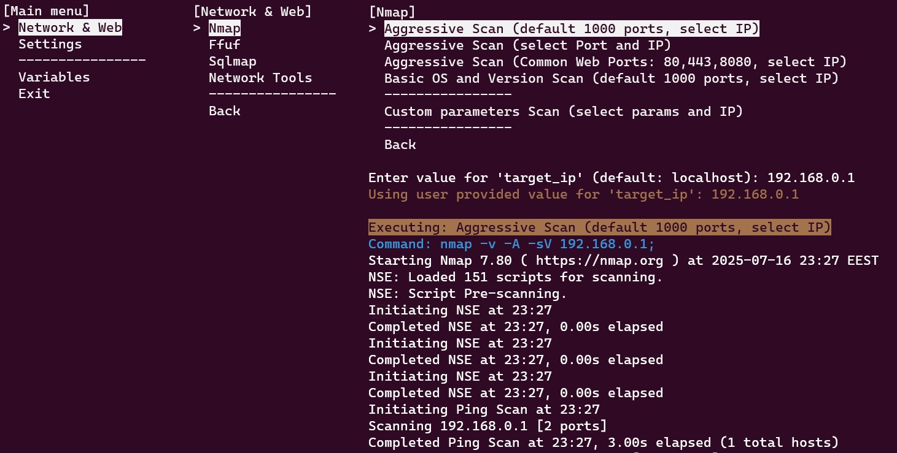

# [Bash-menu – Dynamic CLI Menu System](https://www.youtube.com/watch?v=pwupYDSJ1S8)

This Bash script provides a dynamic, interactive command-line interface (CLI) menu system. It allows users to navigate through various options, execute commands, and manage persistent variables. The menu structure is built dynamically from external `.menu` and `.subm(enu)` files, enabling easy extension and customization without modifying the core script.

---

## 🎯 Purpose

The primary goal of `menu.sh` is to offer a user-friendly way to organize and execute frequently used commands or scripts. It aims to:

- **Simplify Complex Workflows**: Provide a navigable menu for a collection of commands, reducing the need to remember intricate syntax.
- **Enhance Usability**: Use arrow keys and Enter/Backspace for navigation, like in graphical interfaces.
- **Support Modularity**: Load menu items and commands from external files for easy customization.
- **Persist Variables**: Remember user-entered values across sessions.
- **Log Activity**: Maintain logs of executed commands for auditing and troubleshooting.

---

## ⚙️ Principles of Operation

- **Dynamic Menu Generation**:
    - **Main Menus**: Files ending with `.menu` in the `MENU_DIR` become top-level items.
    - **Nested Submenus**: Defined in `.subm` files and linked via the `submenu:` command.

- **External Command Definition**:
  Commands are declared inside `.menu` and `.subm` files in `Menu_Item_Name=Command` format.

- **Variable Persistence**:
  Placeholders like `<ip>` or `<user>` trigger prompts for user input and save the values in `menu.cfg`.

- **Interactive Navigation**:
  Uses arrow keys, Enter, and Backspace within the `show_menu` function.

- **Tmux Integration for Logging**:
  Optional real-time command logging in a separate tmux window (fallback: `tail -f menu/menu.log`).

---

## 📦 Examples of Menu Items

### 1. **Standard Commands with Parameter Prompts**

**Examples:**

    Truncate Log=truncate -s <bytes> menu/menu.log;
####
    Basic OS and Version Scan (default 1000 ports, select IP)=nmap -v -sV -O <target_ip>;
####
    Web Server Python=tmux new-window -P -d -n "Web Server" bash; sleep 0.1; tmux send-keys -t "Web Server" "python3 -m http.server <web_serwer_port>" C-m
####

## How It Works

The menu system operates through several key components:

### Menu Item Structure
- **Menu_Item_Name**:  
  The visible text in your menu  
  *Example:* `"Truncate Log"`

- **Command_to_Execute**:  
  The actual Bash command to run when selected  
  *Format:* `Menu_Display_Name=command_to_run`

### Placeholder System
For parameters like `<target_ip>` and `<web_server_port>`:

1. **Variable Detection**
    - Automatically identifies placeholders in commands
    - Checks for existing environment variables

2. **User Interaction**
   ```plaintext
   Enter value for 'target_ip' (default: 192.168.1.1): 

3. **Value Handling**
   - Stores new values in menu.cfg for persistence
   - Exports as environment variables (export target_ip="...")
   - Replaces all placeholders in the command

## 🛠️ Installation
1. **Clone the Repository**:
   ```bash
   git clone https://github.com/Oleh-Hryshko/bash-menu.git

## Troubleshooting
### If you try to run the example and you get the error:

    -bash: ./menu.sh: Permission denied

### Then you need to update the permissions for the file by running:
    chmod +x menu.sh
####

## 📸 Screenshots


